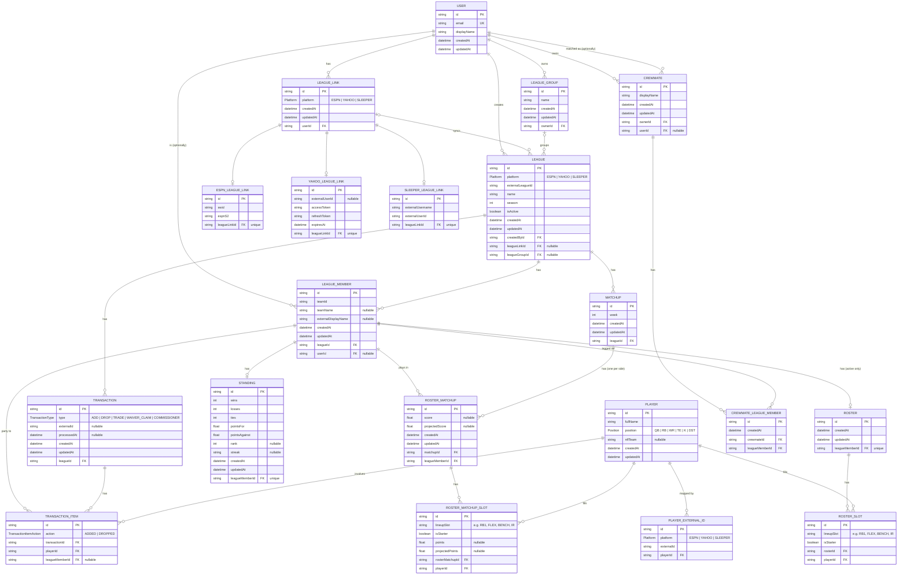

# Database ERD

Generated from `schema.prisma`. Keep this in sync — see the root `CLAUDE.md` for the update rule.

## Notes
- `LeagueLink` is a user's connection to a fantasy platform — one per platform per user (`@@unique([userId, platform])`). It only carries the platform and ownership; the actual credentials live on whichever platform-specific table is attached 1:1 (`EspnLeagueLink`, `YahooLeagueLink`, `SleeperLeagueLink`), since each platform's auth shape is different (ESPN: `swid`/`espn_s2` cookies, Yahoo: OAuth tokens, Sleeper: no auth, just a username/user id).
- `League.leagueLink` is nullable — public leagues (mainly ESPN) can be added without stored credentials.
- `League.createdBy` (FK `createdById`) is the user who added the league; deleting that user is `Restrict`ed rather than cascading, since other users may already be linked to the league via `LeagueMember`.
- `LeagueMember` tracks every roster/owner slot in a league as reported by the platform (`teamId`, unique per league). `userId` is nullable and only set once that member is matched to a First Mate account — this is the join point the crewmate-mapping feature will build on.
- `Player` is the global, platform-agnostic player pool. `PlayerExternalId` maps each platform's own player id onto one `Player` row — this is the "player ID mapper" called out as a technical need in the README.
- `Roster`/`RosterSlot` hold only the **current** active roster for a team (one `Roster` per `LeagueMember`, enforced by the unique `leagueMemberId`) — syncing is expected to run only for active leagues' active rosters, not history. Historical per-week lineups live on `RosterMatchup`/`RosterMatchupSlot` instead.
- `Standing` is likewise a live, continuously-updated cumulative record per team (one row per `LeagueMember`), not a week-by-week history.
- `Matchup` is just the week/league container; each side's participation is its own `RosterMatchup` row (`@@unique([matchupId, leagueMemberId])`, so a bye week simply has one row instead of two) carrying that team's score and projected score. `RosterMatchupSlot` then records, per player, `lineupSlot`/`isStarter` (started vs. benched) and that player's points/projected points for the week.
- `Transaction` is a single platform event (add/drop/trade/waiver/commissioner); `TransactionItem` records each player movement under it, so a trade is just several items spanning multiple `LeagueMember`s under one `Transaction`. `leagueMemberId` on an item is nullable to represent a move to/from free agency.
- `Crewmate` is a contact-list entry **owned by one User** (`ownerId`), not a mutual/bidirectional relationship — it exists specifically so a crewmate doesn't need a First Mate account: `userId` is only set once that person is matched or signs up via invite. `CrewmateLeagueMember` is the many-to-many join that groups a Crewmate's history: it links one `Crewmate` to every `LeagueMember` that represents them across leagues, platforms, and seasons. The same `LeagueMember` can be tagged by several different owners independently (each maintains their own crew even inside a shared league), which is why this needs a join table rather than a column on either side.
- Season history itself needed no new models: every `League` row is already one season (`@@unique([createdById, platform, externalLeagueId, season])`), so `Matchup`/`RosterMatchup`/`RosterMatchupSlot`, `Standing`, and `Transaction`/`TransactionItem` are already permanent per-season records. `LeagueGroup` fills the one real gap — tying the `League` rows for the same real-world league together across years (and even across a platform migration), so history can be viewed as one continuous timeline. Grouping is manual and owned by one `User` (`ownerId`), same rationale as `Crewmate`: the same leagues could be grouped differently by different owners. `League.leagueGroup` is nullable since a league isn't grouped until its owner does so.
- Weekly standings history (a snapshot per week, vs. the current cumulative record `Standing` holds) is intentionally not modeled yet.
